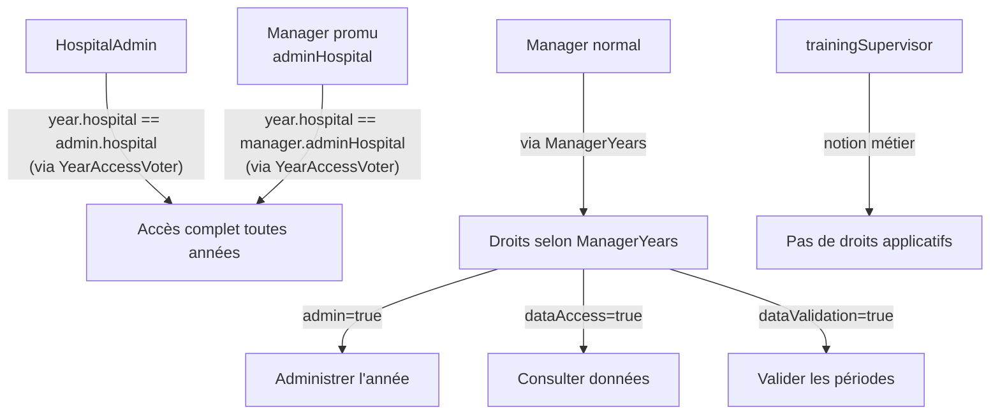
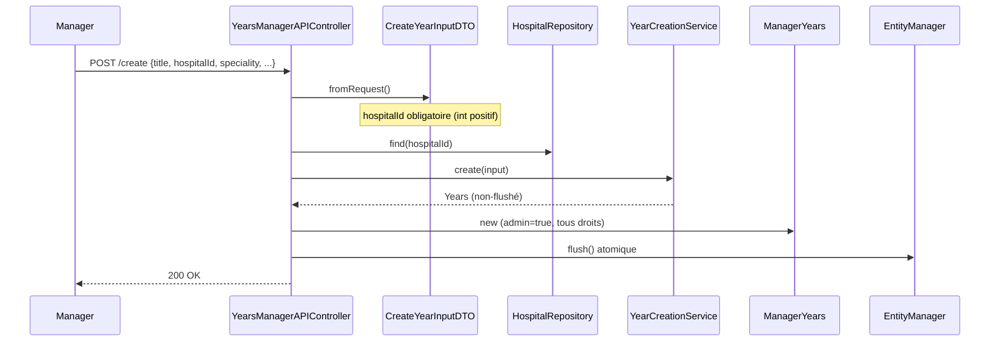

# Modèle Années académiques — Med@Work

**Dernière mise à jour :** 2026-05-31 (après refonte complète du modèle)

---

## Vue d'ensemble

Une **année académique** (`Years`) est la période pendant laquelle un ou plusieurs MACCS (médecins assistants candidats cliniciens) effectuent leur stage dans un hôpital. Elle constitue le pivot central du modèle métier de Med@Work.

```
Hospital (obligatoire)
    │
    ▼
  Years
    │── trainingSupervisor (Manager — maître de stage légal, nullable)
    │── ManagerYears (droits applicatifs par manager)
    └── YearsResident (inscription des MACCS)
```

---

## Entités et responsabilités

### Hospital
- Propriétaire de l'année — toute année appartient à exactement un hôpital
- Source de vérité pour le nom affiché (remplace l'ancien champ `location`)
- Détermine quels HospitalAdmin ont accès à l'année sans ManagerYears
- Regroupe les managers disponibles pour l'ajout en partenaires

### Years
- Période académique avec dates de début/fin
- Hôpital **obligatoire** (`hospital_id NOT NULL`)
- Spécialité médicale (nullable)
- Token unique pour rejoindre l'année (MACCS)
- Maître de stage (`trainingSupervisor`, nullable) — notion légale belge

**Champs actuels :**

| Champ | Type | Contrainte | Description |
|-------|------|-----------|-------------|
| `id` | int | PK | Clé primaire |
| `title` | string(255) | NOT NULL | Titre libre |
| `period` | string(20) | NOT NULL | Ex : "2025-2026" |
| `dateOfStart` | date | NOT NULL | Début du stage |
| `dateOfEnd` | date | NOT NULL | Fin du stage |
| `speciality` | string\|null | nullable | Spécialité médicale |
| `comment` | text\|null | nullable | Commentaire libre |
| `status` | enum | NOT NULL, default active | `draft\|active\|closed\|archived` |
| `token` | string(10) | NOT NULL, UNIQUE | Code d'accès MACCS |
| `hospital_id` | int | **NOT NULL**, FK | Hôpital propriétaire |
| `training_supervisor_id` | int\|null | nullable, FK ON DELETE SET NULL | Maître de stage |
| `created_at` | datetime | NOT NULL | Date de création |

**Champs historiques supprimés :**

| Champ | Supprimé le | Raison | Remplacement |
|-------|-------------|--------|--------------|
| `location` | 2026-05-31 | Copie désynchronisée du nom d'hôpital | `hospital.name` |
| `master` | 2026-05-31 | Entier sans FK, ambiguïté sémantique | `training_supervisor_id` |

### trainingSupervisor
- **Notion métier uniquement** — le maître de stage responsable légal de l'année (obligation belge)
- Relation `ManyToOne` vers `Manager` (nullable, ON DELETE SET NULL)
- **Ne confère aucun droit applicatif** — les droits sont gérés par `ManagerYears`
- Peut être défini à la création (`isMaster=true`) ou modifié ultérieurement (`PUT target='trainingSupervisor'`)
- Affiché sur les cartes d'années et dans les validations mensuelles

```
trainingSupervisor ≠ administrateur de l'année
trainingSupervisor = responsable légal pédagogique
```

### ManagerYears
- Lien entre un `Manager` et une `Years`
- Porte les **droits applicatifs** : `admin`, `dataAccess`, `dataValidation`, `dataDownload`, `hasAgendaAccess`, `canManageAgenda`
- Créée automatiquement pour le manager créateur (tous droits)
- Peut être ajoutée manuellement pour d'autres managers
- `invitedAt` : null = auto-ajouté, non-null = invitation en attente

**Champs :**

| Champ | Type | Description |
|-------|------|-------------|
| `manager_id` | FK | Manager concerné |
| `years_id` | FK | Année concernée |
| `admin` | bool | Droits d'administration (ajout partenaires, modification) |
| `dataAccess` | bool | Consultation des données résidents |
| `dataValidation` | bool | Validation des périodes |
| `dataDownload` | bool | Export Excel |
| `hasAgendaAccess` | bool | Consultation de l'agenda |
| `canManageAgenda` | bool | Modification de l'agenda |
| `invitedAt` | datetime\|null | Date d'invitation (null = auto-intégré) |

> Le champ `owner` (boolean) a été supprimé le 2026-05-29 — il n'était utilisé dans aucune décision de code.

### YearsResident
- Inscription d'un MACCS à une année
- `allowed` : false = en attente, true = accepté
- `optingOut` : le MACCS opt-out du suivi de compliance

---

## Droits d'accès — Vue d'ensemble



| Rôle | Mécanisme d'accès | Source |
|------|-----------------|--------|
| HospitalAdmin | `year.hospital_id === admin.hospital_id` | `YearAccessVoter` |
| Manager promu (`adminHospital`) | `year.hospital_id === manager.adminHospital.id` | `YearAccessVoter` |
| Manager normal | `ManagerYears` row avec droits | `YearAccessVoter` → `ManagerYears` |
| trainingSupervisor | Aucun — concept légal uniquement | — |

---

## Création d'une année

### Flux unifié — `YearCreationService`

Depuis 2026-05-30, un seul service crée les années : `App\Services\YearsManagement\YearCreationService`.

**Ce service :**
1. Génère un token unique (8 caractères hexadécimaux, boucle d'unicité)
2. Crée l'entité `Years` avec le nom de l'hôpital comme référence
3. Génère toutes les `YearsWeekIntervals` (une par semaine sur la période)
4. Persiste sans flusher — le controller décide de l'atomicité

**Input :** `YearCreationInput` (value object) :
```php
YearCreationInput {
    title: string
    speciality: string
    period: string          // "2025-2026"
    dateOfStart: string     // "YYYY-MM-DD"
    dateOfEnd: string       // "YYYY-MM-DD"
    hospital: Hospital      // obligatoire
    status: YearStatus      // default Active
    comment: ?string        // nullable
}
```

### Création par Manager (`POST /api/managers/years/create`)

**Prérequis :** `manager.canCreateYear === true`

**Flux :**


**Objets créés :**
- `Years` avec `hospital_id` lié
- `YearsWeekIntervals` (N intervalles hebdomadaires)
- `ManagerYears` pour le créateur avec `admin=true` et tous les droits

**Si `isMaster=true` :** `year.trainingSupervisor = manager` (le créateur devient maître de stage)

### Création par HospitalAdmin (`POST /api/hospital-admin/years`)

**Prérequis :** Rôle `ROLE_HOSPITAL_ADMIN`

**Flux :** Même `YearCreationService`, `hospital` automatiquement rempli depuis l'hôpital de l'admin.

**Différences :** Aucune `ManagerYears` créée — l'HospitalAdmin accède via `YearAccessVoter` (hospital match). Un audit log `create_year` est créé dans `hospital_admin_audit_log`.

---

## Endpoints principaux

| Route | Méthode | Auth | Description |
|-------|---------|------|-------------|
| `POST /api/managers/years/create` | POST | Manager (canCreateYear) | Créer une année |
| `GET /api/managers/years/getManagersYears` | GET | Manager | Mes années (avec `hospitalName`, `trainingSupervisorFirstname/Lastname`) |
| `GET /api/managers/getYearById/{id}` | GET | Manager (ManagerYears requis) | Détail d'une année |
| `PUT /api/managers/years/update` | PUT | Manager (admin) | Modifier un champ (`title`, `speciality`, `period`, `trainingSupervisor`) |
| `POST /api/managers/years/addManager` | POST | Manager (admin) | Ajouter un partenaire |
| `GET /api/managers/years/{id}/hospital-managers` | GET | Manager (ManagerYears) | Managers disponibles pour l'hôpital |
| `POST /api/hospital-admin/years` | POST | HospitalAdmin | Créer une année |
| `PATCH /api/hospital-admin/years/{id}` | PATCH | HospitalAdmin | Modifier une année |

---

## Commandes de maintenance

```bash
# Audit des années orphelines (dry-run)
php bin/console app:repair-orphan-years

# Réparer les années sans manager_years (Type A)
php bin/console app:repair-orphan-years --fix

# Assigner un hôpital manuellement (Type B — nécessite --map-hospital)
php bin/console app:repair-orphan-years --fix --map-hospital="yearId:hospitalId,..."
```

---

## Règles métier immuables

1. **Toute année appartient à un hôpital** — `hospital_id NOT NULL`
2. **Le trainingSupervisor ≠ accès applicatifs** — notion légale uniquement
3. **Le créateur reçoit automatiquement tous les droits** via `ManagerYears`
4. **Un HospitalAdmin voit toutes les années de son hôpital** sans `ManagerYears`
5. **Les droits applicatifs passent exclusivement par `ManagerYears`**
