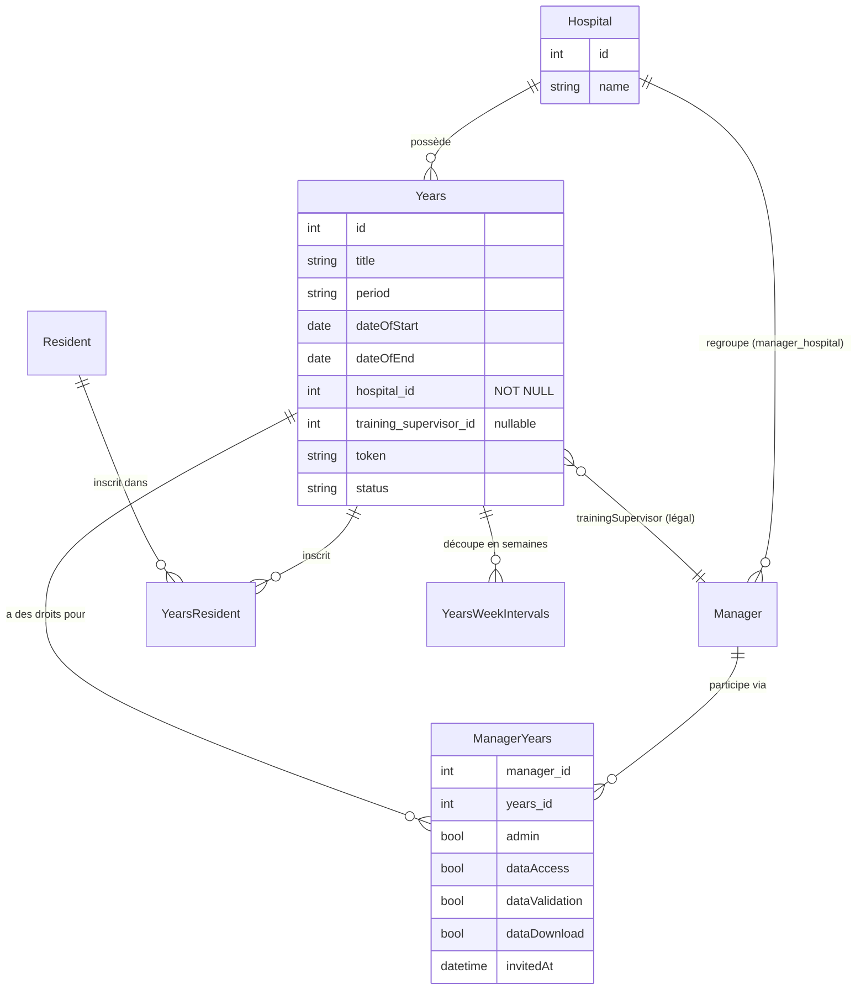

# Comprendre le modèle Années académiques en 5 minutes

> Pour les nouveaux développeurs. Pas besoin de lire tout l'historique.

---

## C'est quoi une "année" dans Med@Work ?

Une **année académique** (`Years`) est une période de stage médical dans un hôpital. Des MACCS (médecins assistants) y sont inscrits. Des managers supervisent.

```
Clinique Saint-Jean
    └── Cardiologie 2025-2026
            ├── Dr. Brigitte Delvaux (maître de stage légal)
            ├── Marc Ledoux (manager, droits admin)
            ├── Sophie Dupont (manager, droits lecture)
            └── Céleste Martin (MACCS inscrite)
```

---

## Les 4 entités à connaître

### 1. `Years` — La période de stage

```php
$year->getHospital();              // Hôpital (OBLIGATOIRE — NOT NULL)
$year->getTrainingSupervisor();    // Maître de stage légal (nullable Manager)
$year->getTitle();                 // "Cardiologie 2025-2026"
$year->getToken();                 // Code pour que les MACCS rejoignent
```

**Points clés :**
- `hospital_id` est **obligatoire** — impossible de créer une année sans hôpital
- `trainingSupervisor` = concept légal belge, **pas** un droit d'accès
- Le nom du lieu vient de `hospital->getName()` — il n'y a plus de champ `location`

### 2. `ManagerYears` — Les droits applicatifs

```php
$my->getAdmin();           // peut gérer l'année (ajouter managers, etc.)
$my->getDataAccess();      // peut voir les données résidents
$my->getDataValidation();  // peut valider les périodes
$my->getDataDownload();    // peut exporter Excel
$my->getCanManageAgenda(); // peut modifier l'agenda
```

**C'est ici que vivent tous les droits.** Pas dans `trainingSupervisor`.

### 3. `Hospital` — L'hôpital

Source de vérité pour le nom, l'adresse, les managers autorisés. Un `HospitalAdmin` voit **toutes** les années de son hôpital automatiquement (sans `ManagerYears`).

### 4. `YearsResident` — Les MACCS inscrits

```php
$yr->getAllowed();    // false = en attente, true = accepté
$yr->getOptingOut(); // le MACCS opt-out du suivi
```

---

## Qui a accès à quoi ?

| Qui | Comment accède | Droits |
|-----|---------------|--------|
| `HospitalAdmin` | `year.hospital_id == admin.hospital_id` | Tous — via `YearAccessVoter` |
| Manager avec `adminHospital` | `year.hospital_id == manager.adminHospital.id` | Tous — via `YearAccessVoter` |
| Manager normal | Via une ligne `ManagerYears` | Selon les flags de la ligne |
| `trainingSupervisor` | **Aucun** | C'est une info légale, pas un accès |

**Règle d'or :** Si tu veux savoir si quelqu'un a accès, cherche dans `ManagerYears` (ou vérifie `YearAccessVoter` pour les admins).

---

## Comment créer une année ?

Il existe **un seul service** : `YearCreationService`.

```php
// Ce que tu passes
$input = new YearCreationInput(
    title: 'Cardiologie 2025-2026',
    speciality: 'cardiology',
    period: '2025-2026',
    dateOfStart: '2025-11-01',
    dateOfEnd: '2026-04-30',
    hospital: $hospital,       // OBLIGATOIRE
);

// Ce que le service fait
$year = $yearCreationService->create($input);
// → crée Years + tous les YearsWeekIntervals
// → ne flush PAS — c'est le controller qui flush
```

**Après le create(), le controller ajoute selon son rôle :**

- **Manager** : crée une `ManagerYears` avec `admin=true` et flush atomique
- **HospitalAdmin** : crée un audit log et flush — pas de `ManagerYears`

---

## Comment modifier le maître de stage ?

```
PUT /api/managers/years/update
Body: { yearId: 42, target: "trainingSupervisor", newValue: 7 }
//                                                           ↑ manager ID
```

Le service `UpdateYear` va :
1. Charger le Manager correspondant (`findOneBy(['id' => 7])`)
2. Appeler `$year->setTrainingSupervisor($manager)`
3. Accorder automatiquement `admin=true` à ce manager dans `ManagerYears`

---

## Les choses qui n'existent plus

| Ce que tu pourrais chercher | Ce que tu dois faire à la place |
|---|---|
| `$year->getLocation()` | `$year->getHospital()->getName()` |
| `$year->getMaster()` | `$year->getTrainingSupervisor()` |
| `$myYears->getOwner()` | N'existe pas — `owner` a été supprimé |
| `$dto->location` | Le champ n'est plus dans le DTO |
| `target='location'` dans UpdateYear | N'est plus supporté |
| `target='master'` dans UpdateYear | Utiliser `target='trainingSupervisor'` |

---

## Les endpoints à connaître

```
POST /api/managers/years/create          → Créer (Manager, hospitalId obligatoire)
GET  /api/managers/years/getManagersYears → Mes années (avec hospitalName, trainingSupervisor*)
GET  /api/managers/getYearById/{id}       → Détail (hospitalName, trainingSupervisor*)
PUT  /api/managers/years/update           → Modifier (target: title|speciality|period|trainingSupervisor)
POST /api/managers/years/addManager       → Ajouter un partenaire
GET  /api/managers/years/{id}/hospital-managers → Managers de l'hôpital disponibles

POST  /api/hospital-admin/years           → Créer (HospitalAdmin, hôpital auto)
PATCH /api/hospital-admin/years/{id}      → Modifier

GET   /api/years/getResidentYears         → Mes années (MACCS)
POST  /api/residents/years/joinYear       → Rejoindre via token
```

---

## En cas de doute

1. **Qui a accès ?** → `YearAccessVoter` + `ManagerYears`
2. **Quel hôpital ?** → `year.hospital` (jamais `location`)
3. **Qui est le maître de stage ?** → `year.trainingSupervisor` (info légale, pas un droit)
4. **Comment créer ?** → `YearCreationService::create(YearCreationInput)`
5. **Quelque chose de bizarre ?** → Vérifie `app:repair-orphan-years` (années sans manager_years)

---

## Schéma Mermaid complet


